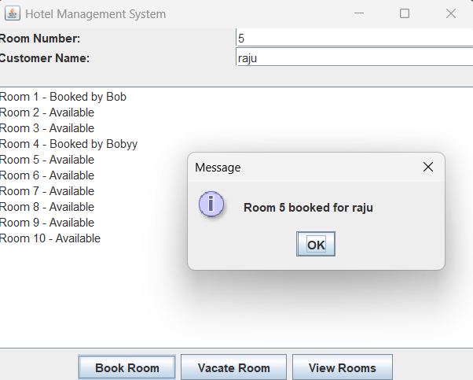

# Hotel Management System 🏨

A Java Swing-based Hotel Management System to manage rooms, bookings, and guests with a clean, modular folder structure.

## 📂 Folder Structure
HotelManagementSystem/
└── src/
└── HotelManagement/
├── Main.java       # Entry point of the application
├── Hotel.java      # Handles hotel logic & data
└── Room.java       # Represents individual room details

## ✨ Features
- Add and manage hotel rooms
- Book and release rooms
- View all room details
- Simple and intuitive Swing GUI

## 🛠️ Tech Stack
- Java (Swing for GUI)
- IntelliJ IDEA

## 🚀 How to Run
1. Clone the repository
   git clone https://github.com/Krishnagithubhere/HotelManagementSystem.git
2. Open in IntelliJ IDEA
3. Run Main.java

## 📸 UI Preview
(Add screenshot of your application here)

